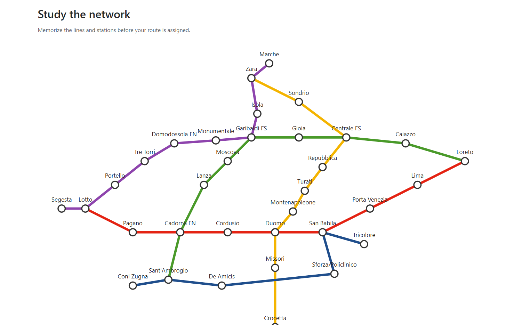
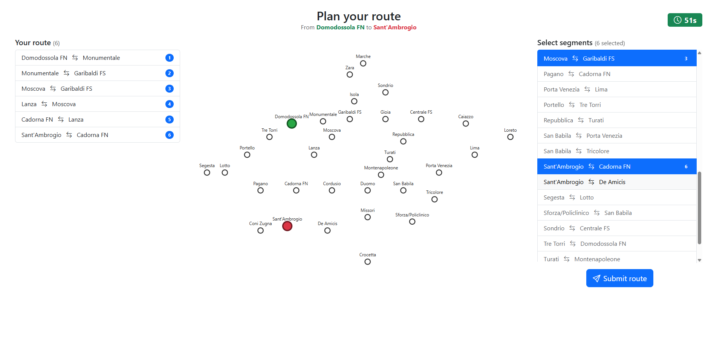
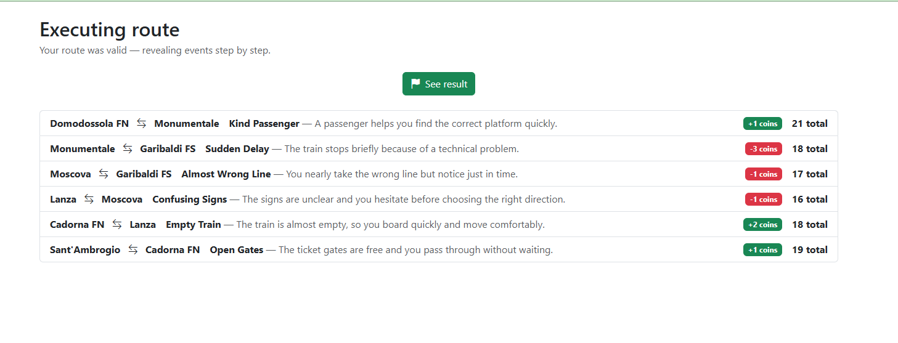
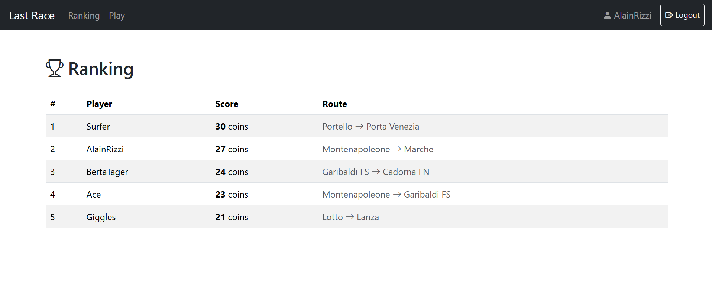

# Exam #1: "Last Race"
## Student: s350714 Rizzi Alain 

## React Client Application Routes

- Route `/`: home page with game instructions and login/play buttons
- Route `/login`: login form
- Route `/game`: full game session (setup, planning, execution, result phases)
- Route `/ranking`: general leaderboard
- Route `*`: page not found

## API Server

- `POST /api/sessions` — login
  - Request body:
    ```json
    {
        "username": "AlainRizzi",
        "password": "alain123" 
    }
    ```
  - Response body:
    ```json
    { 
        "id": 1, 
        "username": "AlainRizzi", 
        "name": "Alain" 
    }
    ```

- `DELETE /api/sessions/current` — logout [isAuthenticated]
  - Request body: none
  - Response body: none

- `GET /api/sessions/current` — get current logged-in user [isAuthenticated]
  - Request body: none
  - Response body:
    ```json
    { 
        "id": 1, 
        "username": "AlainRizzi", 
        "name": "Alain" 
    }
    ```

- `GET /api/network` — get full network map with lines and stations [isAuthenticated]
  - Request body: none
  - Response body:
    ```json
    [
        { 
            "code": "M1", 
            "name": "Linea M1", 
            "color": "#E42313",
            "Stations": 
            [
                { 
                    "name": "Lotto", 
                    "x": 10, 
                    "y": 20 
                }, ...
            ] 
        }, ...
    ]
    ```

- `POST /api/games` — start a new game, server assigns start and destination stations [isAuthenticated]
  - Request body: none
  - Response body:
    ```json
    { 
        "id": 3, 
        "startStation": 
        { 
            "name": "Lotto", 
            "x": 10, 
            "y": 20 
        },
        "destinationStation": 
        { 
            "name": "Duomo", 
            "x": 50, 
            "y": 60 
        }
    }
    ```

- `POST /api/games/:id/route` — submit planned route; server validates, applies random events, stores result [isAuthenticated]
  - Request body:
    ```json
    { 
        "segments": 
        [
            { 
                "station1": "Lotto", 
                "station2": "Pagano" 
            }, ...
        ] 
    }
    ```
  - Response body:
    ```json
    { 
        "valid": true, 
        "steps": 
        [
            { 
                "station1": "Lotto", 
                "station2": "Pagano", 
                "event": 
                { 
                    "title": "Crowded Train", 
                    "description": "...", 
                    "effect": -1 
                },
                "coinsAfter": 19
            }, ...
        ], 
        "finalScore": 18 
    }
    ```

- `GET /api/ranking` — get best score per registered user, sorted descending [isAuthenticated]
  - Request body: none
  - Response body:
    ```json
    [
        { 
            "username": "AlainRizzi", 
            "score": 22,
            "startStation": "Lotto",
            "destinationStation": "Duomo"
        }, ...
    ]
    ```

## Database Tables

- Table `users` - id, username, name, salt, hash
- Table `metro_lines` - code, name, color
- Table `stations` - name, x, y
- Table `line_stations` - line_code, station_name, position
- Table `events` - id, title, description, effect, probability_weight
- Table `games` - id, user_id, start_station_name, destination_station_name, final_score, route_valid, status

## Main React Components

- `App` (in `App.jsx`): root component - holds user/login state, defines all routes, wraps everything in `UserContext.Provider`
- `NavBar` (in `NavBar.jsx`): top navigation bar - shows Ranking, Play, and a Logout button for logged-in users with username of the user, Login button otherwise
- `HomePage` (in `HomePage.jsx`): landing page with game instructions - shows Play/Ranking buttons for logged-in users or a Login button for anonymous users
- `LoginPage` (in `LoginPage.jsx`): login form with username and password fields - calls `onLogin` prop and displays server errors
- `GamePage` (in `GamePage.jsx`): full game session manager - holds all state, timer logic, and API calls; delegates rendering to the four phase components below
- `SetupPhase` (in `SetupPhase.jsx`): study-the-network screen with the full metro map and a Start game button
- `PlanningPhase` (in `PlanningPhase.jsx`): 90s countdown timer, segment selector, selected-route list, and map with start/destination highlighted
- `ExecutionPhase` (in `ExecutionPhase.jsx`): step-by-step event reveal with coin deltas, Next step / See result button
- `ResultPhase` (in `ResultPhase.jsx`): final score card with Play again and Go home actions
- `NetworkMap` (in `NetworkMap.jsx`): SVG metro map rendered from network data - supports hiding lines (`showLines`) and highlighting start/destination stations in green/red
- `RankingPage` (in `RankingPage.jsx`): leaderboard table showing best score per user with route info - fetches data on mount

## Screenshots

The setup phase lets the player study the full metro network before the route is assigned.



During planning the player has 90 seconds to select route segments on the map from the assigned start to destination station.



The execution phase reveals each segment's random event and coin effect one step at a time.



The ranking page shows each user's best valid score alongside their route.



## Users Credentials

- AlainRizzi, alain123
- BertaTager, berta123
- Surfer, matheus123
- Ace, alembert123
- Giggles, anabella123

## Use of AI Tools
Used ChatGPT and Claude for discussion about the needed tables and models and they were extremely helpful in turning the image of Milan Metro Lines into x,y coordinates that helped model the map using svg.